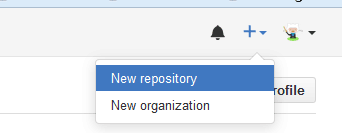
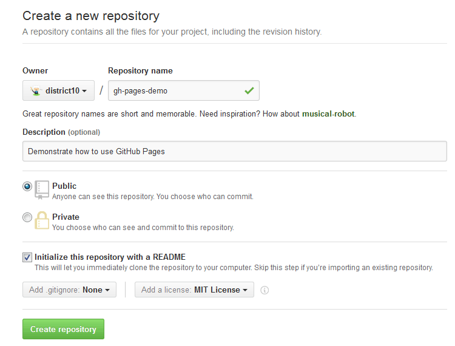
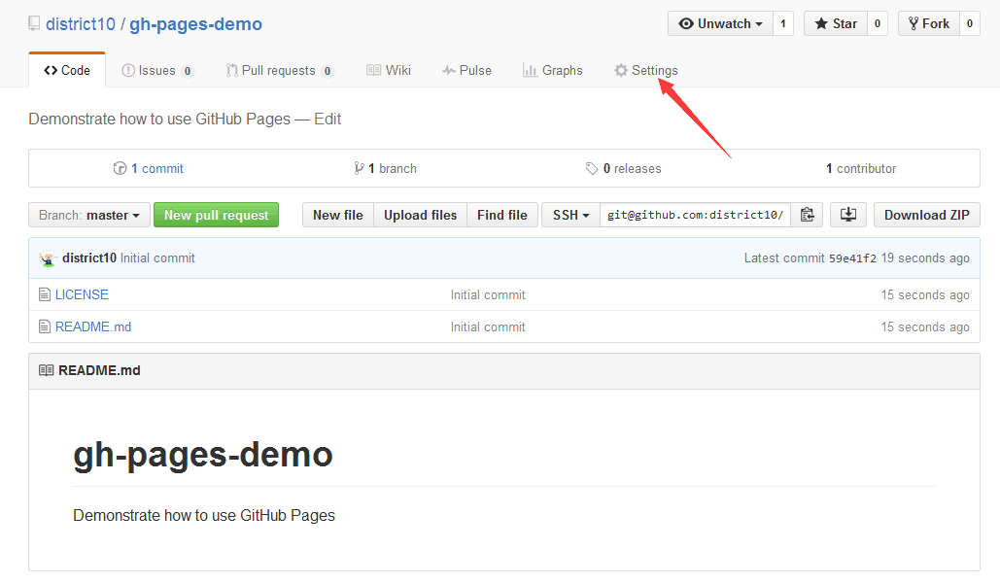
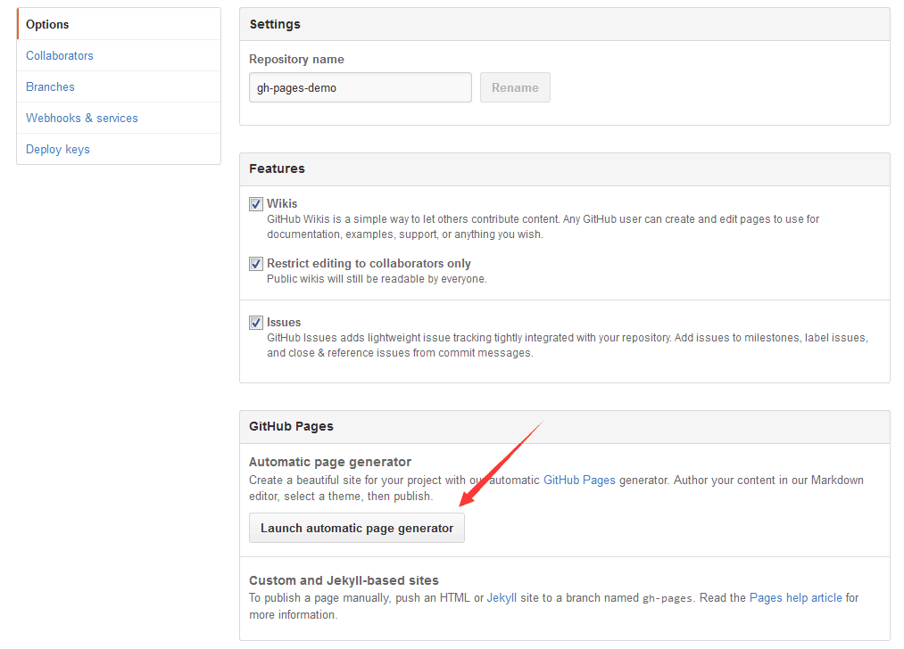
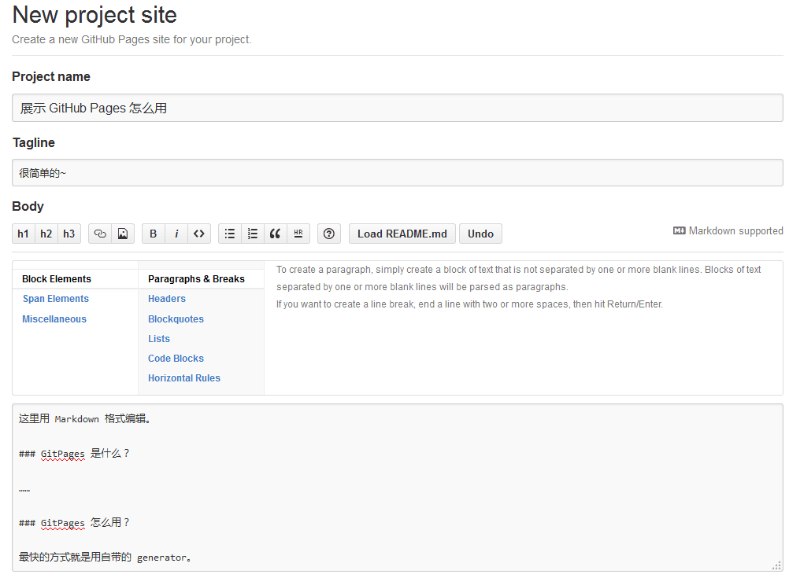
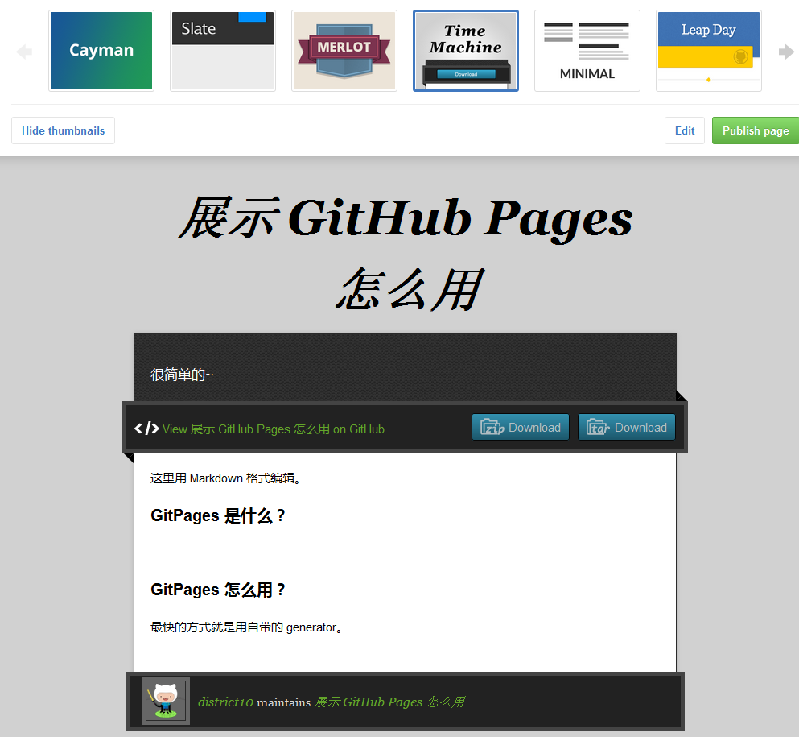
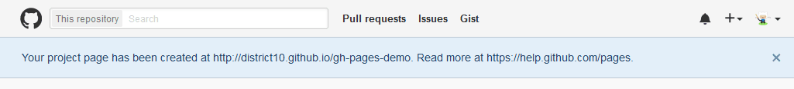
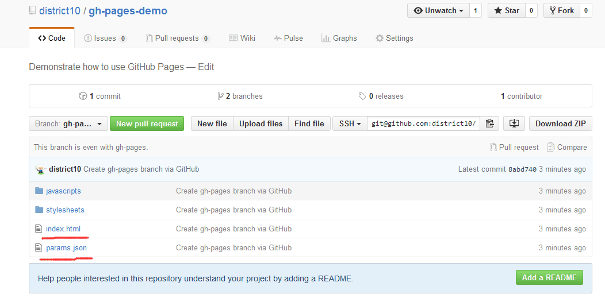
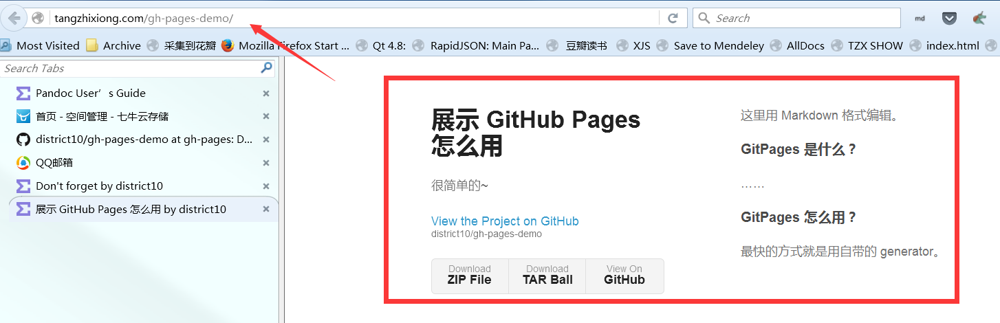

# gh-pages-demo

Demonstrate how to use GitHub Pages

说说怎么用 GitHub 的 Pages 服务。

如下图，首先，新建一个 repo。

输入 repo 的名称，描述，【一定】要勾选生成 README 这个选项，不然你不懂命令行使用 `git` 就傻了。
然后点击 `Create repository`。

然后就可以看到 repo 生成好了。里面有一个 README.md 文件。
要生成 GitHub Pages，最简单的方式就是用官方的 generator。
先点击 `Settings`，如下图。

然后 `Launch automatic page generator`。

在这个页面编辑这个 repo 的主页，首先设置 Project Name，其实是 Tagline，
然后下面有默认生成的 GitHub Pages 指导说明，你把这些文字改成自己的，就可以了。
这里用的是 Markdown 语法。当然你也可以用上面提供的富文档编辑按钮。

然后点击下方的按钮，就到了下面的界面。这是 GitHub Pages 提供的模板。你可以从里面选择
自己喜欢的风格。

比如这是 Time Machine 风格。

我喜欢 Minimal 风格，所以选了它。选完后点击 `publish page`，主页就生成好了。
GitHub 会把你带回到 repo 主界面，并提示你主页生成好了，地址在 blah blah，如下图：

先不急去那个主页，看看 repo 下面多了什么？一个新的 Branch，叫 `gh-pages`，点击它。

发现下面有一个 `index.html`，一个 `params.json`，还有两个文件夹。这就是网页的所有源码。
`index.html` 是主页，`params.json` 包含了你主页的 Markdown 内容，以及你的标题，Tagline 信息，等等。

然后去自己的 repo 展示主页看看把，如果你的 repo 叫 `some-repo`，你的用户名叫 `some-user`，那你的
repo 的 GitHub Pages 主页就是 `<some-user>.github.io/some-repo`。如下图。

